# Proyecto Gestor de Cursos

## Descripción

**Proyecto Gestor de Cursos** es una aplicación web desarrollada para facilitar la gestión académica de **cursos, estudiantes, profesores y entregables**.

El sistema permite administrar la información mediante operaciones **CRUD**, realizar búsquedas, registrar y modificar datos, gestionar entregables y asociarlos con los estudiantes correspondientes.

El proyecto fue desarrollado utilizando **Python y Django**, con **SQLite** como base de datos y **HTML, CSS y Bootstrap** para la interfaz. También se utilizaron formularios y migraciones de Django para la gestión y validación de los datos.

El desarrollo y control de versiones se realizó mediante **Visual Studio Code y Git/GitHub**, permitiendo registrar los avances y cambios realizados durante las distintas etapas del proyecto.

---

## Integrantes

- **Antonella Boccalandro**
- **Candela Mimbi Cáceres**

---

## Tecnologías utilizadas

### Lenguajes y Frameworks

- **Python**
- **Django**
- **HTML5**
- **CSS3**

### Base de datos

- **SQLite**

### Interfaz

- **Bootstrap**

### Herramientas de desarrollo

- **Visual Studio Code**
- **Git**
- **GitHub**

---

## Funcionalidades principales

- Gestión de cursos
- Gestión de estudiantes
- Gestión de profesores
- Gestión de entregables
- Registro de información
- Modificación de datos
- Eliminación de registros
- Búsqueda de cursos
- Asociación de entregables con estudiantes
- Validación de datos mediante formularios
- Gestión de cambios mediante migraciones de Django
- Autenticación de usuarios.
- Roles de Administrador y Profesor.
- Gestión de asistencia y promedio por curso.
- Gestión de alumnos y entregables diferenciada por curso.
- Permisos de acceso según rol.
- Acceso del Profesor únicamente a sus cursos.
- Registro de entregas de estudiantes.

---

## Objetivo del proyecto

El objetivo del proyecto es desarrollar una aplicación web que permita **centralizar y facilitar la gestión de información académica**, utilizando herramientas y tecnologías estudiadas durante la formación en Desarrollo de Software.

---

## Estructura del proyecto

La versión actual del proyecto se encuentra organizada utilizando **Django**, separando la configuración del proyecto de la aplicación encargada de las funcionalidades principales.

---

## Estado del proyecto

**En desarrollo.**

El proyecto continúa siendo actualizado mediante Git y GitHub, registrando los avances y modificaciones realizados durante las diferentes etapas.

## Evidencia
### Panel de Gestión
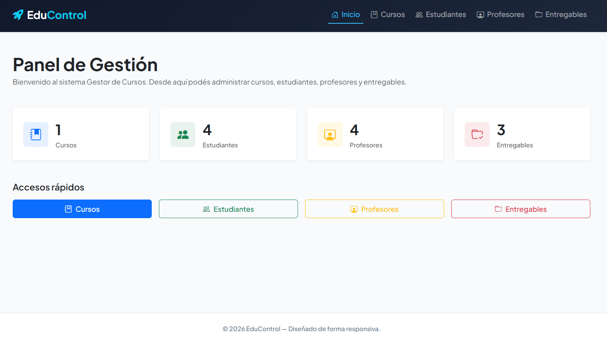

### Cursos
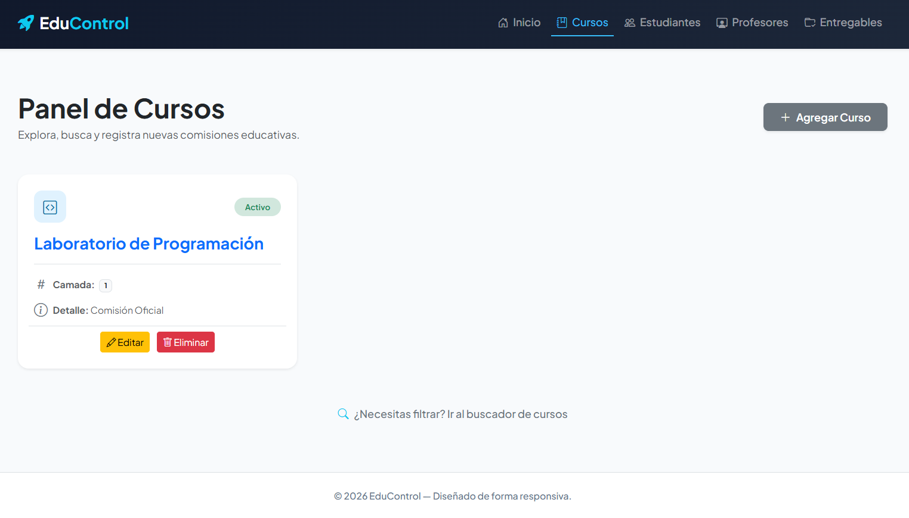

### Alta de Cursos
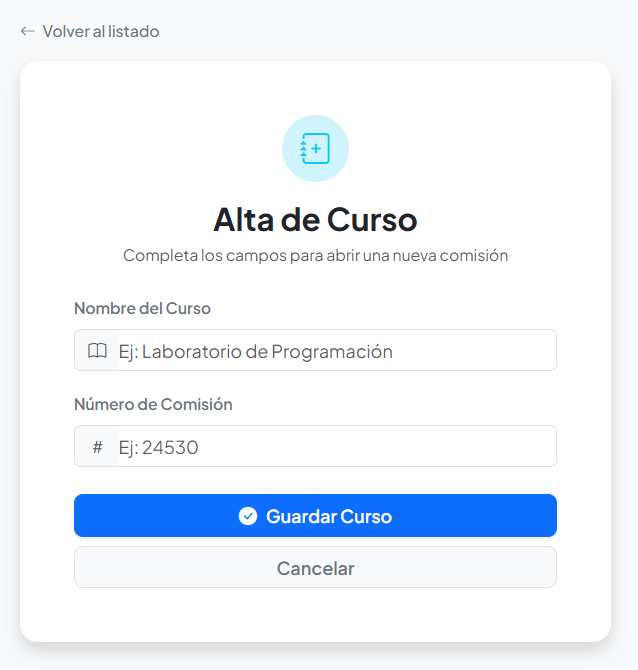

### Estudiantes
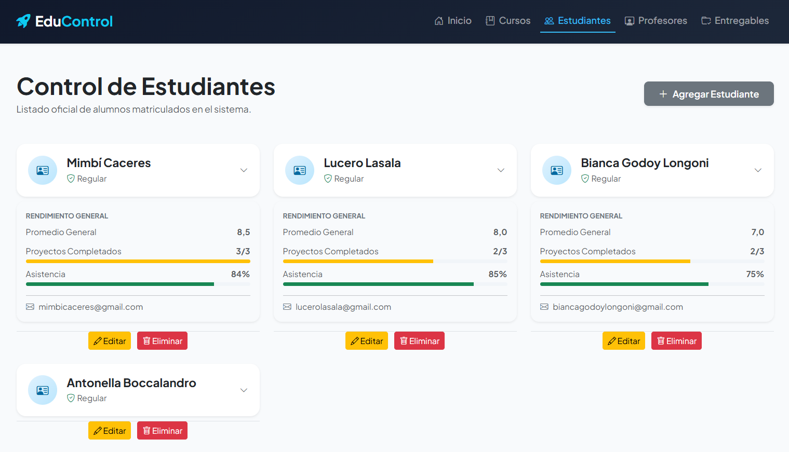

### Editar estudiante
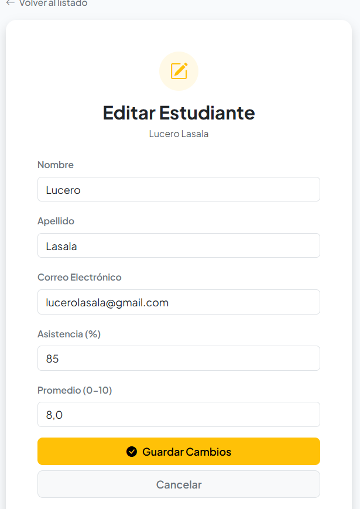

### Eliminar estudiante
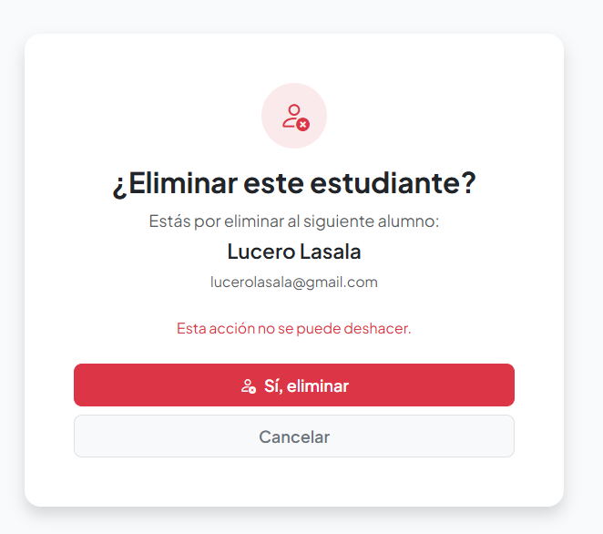

### Profesores
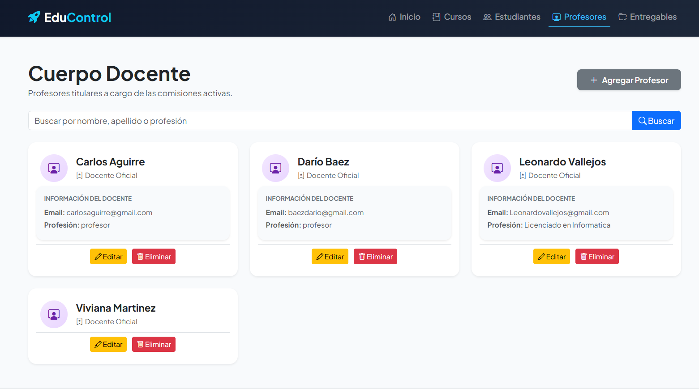

### Editar profesor
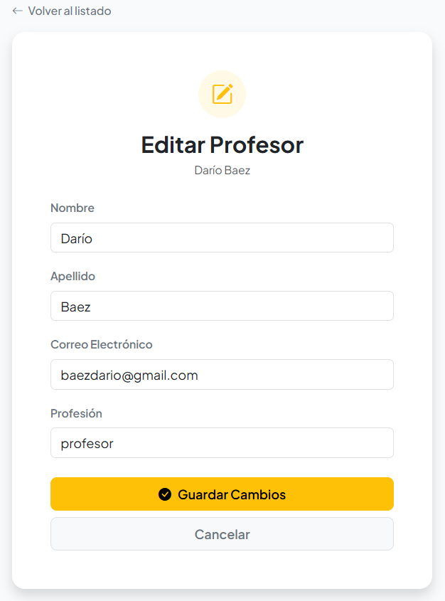

### Eliminar profesor
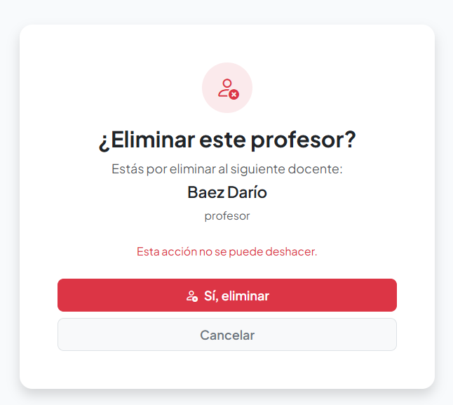

### Entregables
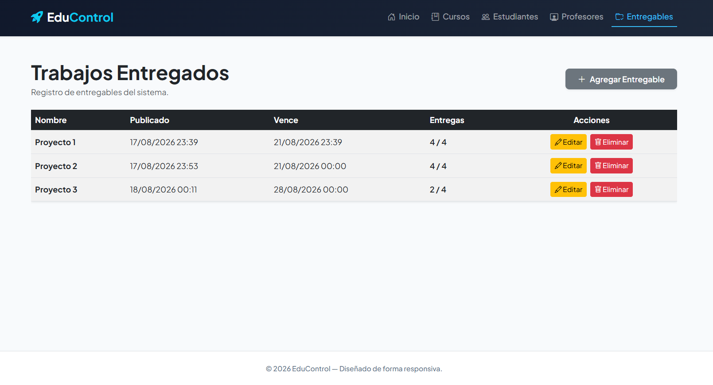

### Editar entregables
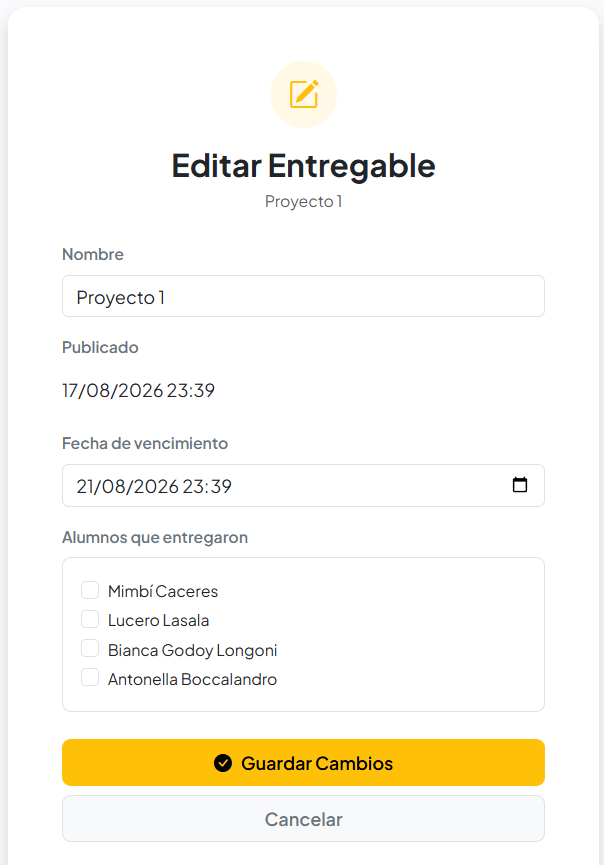

# Historial y organización del trabajo

A continuación se deja constancia de la evolución del proyecto y de una situación ocurrida durante la integración del trabajo de los integrantes del equipo.

 ## 1. Creación del repositorio y primera entrega — 13/06/2026

Se creó el repositorio ProyectoGestorCursos y se realizó la primera entrega del proyecto Django.

La estructura inicial desarrollada fue:
```text
config/
cursos/
manage.py
```
Esta primera versión incluía las funcionalidades iniciales para la gestión de Cursos, Estudiantes, Profesores y Entregables.

## 2. Incorporación de un proyecto desarrollado de forma independiente — 06/07/2026

Posteriormente, una integrante del equipo incorporó al repositorio una nueva estructura de proyecto Django creada de manera independiente, en lugar de continuar trabajando sobre los archivos y la estructura que ya se encontraban en el repositorio.

La nueva estructura incorporada fue:
```text
Proyecto1/
myApp/
manage.py
```
Esto puede comprobarse directamente en el commit correspondiente al 06/07/2026, donde aparecen archivos nuevos de Django como "Proyecto1/settings.py", "Proyecto1/urls.py", "Proyecto1/wsgi.py", "myApp/models.py", "myApp/views.py", "myApp/urls.py" y las distintas plantillas.

Es importante aclarar que esta nueva estructura no consistió en modificaciones de los archivos originales "config/" y "cursos/", sino en la creación e incorporación de otra estructura de proyecto ("Proyecto1/" y "myApp/").

Además, el historial de Git muestra que ambas estructuras no provenían de una misma línea de commits, lo que explica la coexistencia de ambos proyectos dentro del repositorio.

## 3. Problema generado durante la sincronización local

Al realizar posteriormente un "git pull" para sincronizar el repositorio, los cambios incorporados hicieron que en el entorno local coexistieran las dos estructuras de proyecto.

Como consecuencia, en el entorno de desarrollo local llegaron a aparecer simultáneamente:
```text
config/
cursos/
```
y
```text
Proyecto1/
myApp/
```
Esto generó confusión sobre cuál era la estructura que debía utilizarse para continuar el desarrollo.

## 4. Reorganización y continuidad del proyecto

Para evitar continuar trabajando con dos proyectos Django diferentes, se revisó el historial de Git y se identificó cuál de las estructuras había continuado recibiendo modificaciones.

A partir de esa revisión se decidió continuar el desarrollo sobre:
```text
Proyecto1/
myApp/
```
La estructura original "config/" y "cursos/" corresponde a la primera etapa del proyecto y se conserva en el historial como parte de la evolución del repositorio.

## 5. Desarrollo posterior

Sobre la estructura "Proyecto1/myApp" se continuó trabajando en las funcionalidades del sistema, incluyendo:

- CRUD de cursos.
- CRUD de estudiantes.
- CRUD de profesores.
- Gestión de entregables.
- Formularios de creación y edición.
- Eliminación de registros.
- Búsqueda de cursos.
- Asociación de estudiantes con entregables.
- Validaciones.
- Migraciones de la base de datos.
- Mejoras de interfaz y navegación.

Los cambios realizados pueden verificarse mediante los commits correspondientes del repositorio.

## 6. Completar funcionalidades y gestión de entregables — 18/08/2026

Se continuó el desarrollo del sistema sobre la estructura Proyecto1/myApp, completando las funcionalidades principales de la aplicación.

Entre los cambios realizados se incorporaron:

- Formularios para cursos, estudiantes, profesores y entregables.
- Operaciones CRUD para los distintos registros.
- Gestión de entregables asociados a estudiantes.
- Fechas de publicación y vencimiento de los entregables.
- Registro de la cantidad de estudiantes que entregaron.
- Validaciones en los formularios.
- Ajustes de configuración de Django, incluyendo idioma y zona horaria de Argentina.
- Incorporación de `widget_tweaks` para mejorar el manejo de formularios.

Estos cambios quedaron registrados en el commit **"Completa CRUD y gestión de entregables"**.

## 7. Incorporación de autenticación y roles — 19/08/2026

Se incorporó un sistema de autenticación mediante usuarios de Django y se establecieron dos roles dentro de la aplicación:

- Administrador.
- Profesor.

Se implementaron restricciones de acceso según el rol del usuario y se vinculó cada profesor con su correspondiente cuenta de usuario.

También se incorporó la gestión de cursos con profesores e inscripciones de estudiantes, permitiendo relacionar los cursos con los profesores correspondientes.

Se agregaron además funcionalidades para que los profesores puedan trabajar con los cursos que tienen asignados y gestionar la información académica de sus estudiantes.

Estos cambios quedaron registrados en el commit **"Agrego login, roles de administrador y profesor, y gestión de cursos con inscripciones y entregables por curso"**.

## 8. Separación de funciones entre Administrador y Profesor — 19/08/2026

Se realizaron ajustes en los permisos y funcionalidades disponibles para cada tipo de usuario.

El Administrador quedó orientado a la gestión general del sistema, mientras que el Profesor pasó a trabajar únicamente con los cursos que tiene asignados.

Se incorporó la gestión de asistencia y promedio por inscripción, permitiendo que estos datos sean independientes para cada estudiante dentro de cada curso.

También se reforzó el control de acceso para impedir que un profesor pueda modificar información perteneciente a cursos que no tiene asignados.

Estos cambios quedaron registrados en el commit **"Agrego correcciones de separación entre Administrador y Profesor, gestión académica por curso y entregables por profesor"**.

## 9. Separación de alumnos y entregables por curso — 19/08/2026

Se reorganizó la navegación del Profesor para separar la gestión de alumnos y la gestión de entregables.

La información de los alumnos se mantiene en la vista del curso, mientras que los entregables cuentan con una página independiente.

Se incorporó una nueva vista para consultar y administrar los entregables correspondientes a cada curso, manteniendo las restricciones de acceso según el profesor asignado.

También se realizaron ajustes en la navegación para facilitar el acceso entre las diferentes secciones del curso.

Estos cambios quedaron registrados en el commit **"Agrego separación de alumnos y entregables por curso"**.

## 10. Pantalla de bienvenida y ajustes de interfaz — 03/09/2026

Se incorporó una pantalla de bienvenida para el sistema y se realizaron nuevos ajustes visuales en la interfaz.

La pantalla de bienvenida presenta el sistema antes del acceso a la aplicación y se realizaron modificaciones en la estructura general de las vistas para mejorar la presentación y distribución del contenido.

Estos cambios quedaron registrados en el commit **"feat: agrega pantalla de bienvenida y ajustes de interfaz"**.

## 11. Mejoras de diseño y responsividad — 08/09/2026

Se realizaron nuevas mejoras de diseño y adaptación de las vistas para lograr una interfaz más compacta y responsive.

Entre los cambios realizados se encuentran:

- Ajustes de escala y tamaños de tipografía.
- Reducción de espacios excesivos en las vistas.
- Ajustes en tarjetas y formularios.
- Mejoras en la distribución de los elementos.
- Adaptación de la navegación.
- Mejoras en la visualización de mensajes del sistema.
- Ajustes generales de responsividad.

Estos cambios quedaron registrados en el commit **"Mejora diseño y responsividad de las vistas"**.
